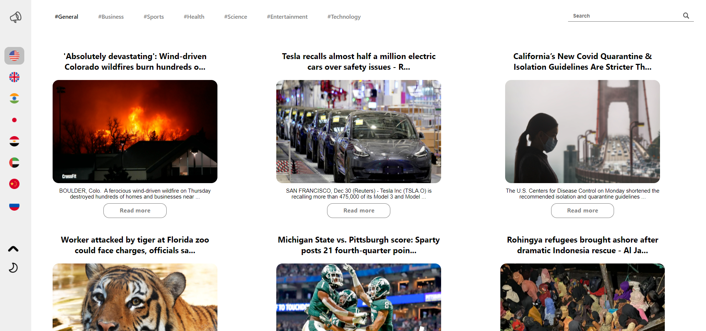
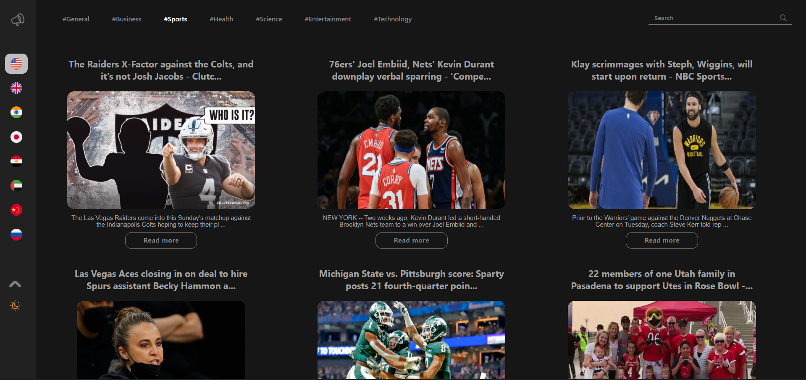
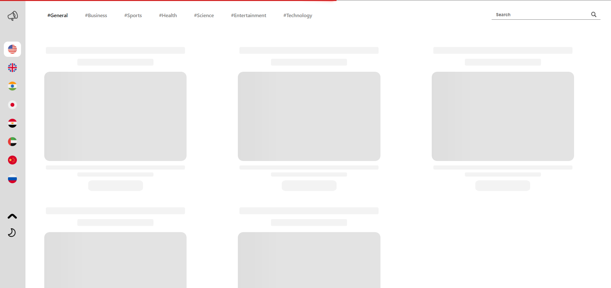
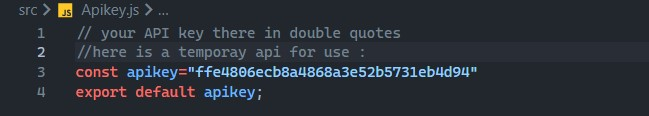

## News App made using ReactJS
### Packages Used :
#### • Axios
#### • NewsAPI
#### • react-hot-toast
#### • Material UI
<!-- #### 𝘾𝙝𝙚𝙘𝙠 𝙤𝙪𝙩 𝙩𝙝𝙚 𝙙𝙚𝙥𝙡𝙤𝙮𝙢𝙚𝙣𝙩 : https://nisabmohd.github.io/news/ -->
##  

### Screenshots : 

<p align="center">
  <p>Light Mode : </p>
  
   <p>Dark Mode : </p>
    
 <p>Skeleton : </p>
    

</p>

##  

𝙉𝙊𝙏𝙀: 𝘿𝙤𝙣𝙩 𝙛𝙤𝙧𝙜𝙚𝙩 𝙩𝙤 𝙪𝙨𝙚 𝙮𝙤𝙪𝙧 𝘼𝙋𝙄𝙠𝙚𝙮 𝙗𝙮 𝙜𝙚𝙩𝙩𝙞𝙣𝙜 𝙖𝙩          https://newsapi.org/


<p align="center">
  

</p>

<br/>


## How To Use

<!-- Example: -->

To clone and run this application, you'll need [Git](https://git-scm.com) and [Node.js](https://nodejs.org/en/download/) (which comes with [npm](http://npmjs.com)) installed on your computer. From your command line:

```bash
# Clone this repository
$ git clone https://github.com/nisabmohd/news.git

# Install dependencies
$ npm install

# Run the app
$ npm start
```
